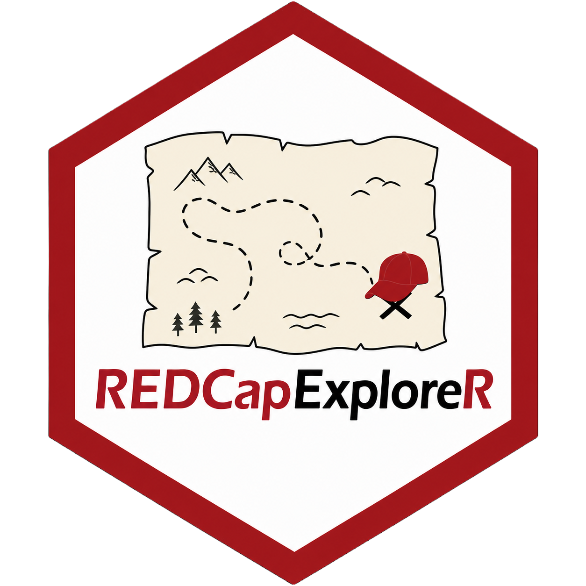

<!-- README.md is generated from README.Rmd. Please edit that file -->

```{r, include = FALSE}
knitr::opts_chunk$set(
  collapse = TRUE,
  comment = "#>",
  fig.path = "man/figures/README-",
  out.width = "100%"
)
```

# REDCapExploreR <a href="https://chop-cgtinformatics.github.io/REDCapExploreR/"></a>

<!-- badges: start -->
[](https://lifecycle.r-lib.org/articles/stages.html#stable)
[](https://github.com/CHOP-CGTInformatics/REDCapExploreR/actions/workflows/R-CMD-check.yaml)
[](https://app.codecov.io/gh/CHOP-CGTInformatics/REDCapExploreR?branch=main)
<!-- badges: end -->

The goal of REDCapExploreR is to provide users with tools to perform exploratory data analysis on and quality assessments of REDCap project data using the REDCap API.

This repository is in early stages active development!

## Installation

You can install the development version of REDCapExploreR like so:

``` r
devtools::install_github("CHOP-CGTInformatics/REDCapExploreR")
```

## Collaboration

We invite you to give feedback and collaborate with us! If you are
familiar with GitHub and R packages, please feel free to submit a [pull
request](https://github.com/CHOP-CGTInformatics/REDCapExploreR/pulls).
Please do let us know if REDCapExploreR fails for whatever reason with
your database and submit a bug report by creating a GitHub
[issue](https://github.com/CHOP-CGTInformatics/REDCapExploreR/issues).

Please note that this project is released with a [Contributor Code of
Conduct](https://github.com/CHOP-CGTInformatics/REDCapExploreR/blob/main/CONDUCT.md).
By participating you agree to abide by its terms.